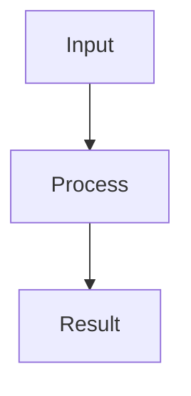

# Update Embedded Project Docs

## Goal

Turn conversation context, existing documents, code facts, logs, protocol traces, and hardware validation evidence into maintainable embedded software project documentation.

The goal is not to create more documents. The goal is to put verified, reusable engineering knowledge in the right place, with clear boundaries between current implementation, target capability, reference-project behavior, and unverified assumptions.

## Default Entry Points

The project documentation is maintained under `docs/`. Always start there.

### Bootstrap Detection

Before Phase 1, check if `docs/README.md` exists in the project root.

- **If it does not exist:** Enter Bootstrap mode (see Phase 0 below). Generate the full documentation scaffold, then proceed to Phase 1.
- **If it exists:** Skip Bootstrap and proceed directly to Phase 1.

The user can also explicitly trigger Bootstrap by saying "初始化文档", "setup docs", or "init docs".

For this documentation package, read:

1. `docs/README.md`: confirm the documentation entry point, document types, and trust rules.
2. `docs/GUIDE.md`: confirm the `{NN}-{TYPE}-{title}.md` naming rule, templates, and quality checks.
3. The user-specified target documents.
4. Relevant firmware code, logs, tests, protocol traces, or reference-project files when implementation facts are involved.

New or updated documents should be written to the appropriate type directory under `docs/` by default.

If the user specifies a different project documentation root, use that root's README/GUIDE first, then apply this skill's embedded documentation workflow.

## Core Principles

### 1. Verify Before Writing Implementation Claims

Do not describe target behavior as current behavior. For embedded projects, implementation claims should be backed by at least one of:

- Current source code path, function, struct, enum, macro, or config.
- Build or test output.
- Board runtime logs.
- UART/Modbus/MQTT/AT/protocol trace.
- Logic analyzer, oscilloscope, or other hardware evidence.
- Explicit reference-project comparison.

If only static code review was performed, state that clearly. If no board validation was performed, write "待上板验证" or "not board-verified".

### 2. Prefer Updating Existing Docs

Do not default to creating a new document.

| Situation | Action |
|-----------|--------|
| Existing doc has the right topic but stale facts | Update the existing doc |
| Multiple docs duplicate the same topic | Merge or demote duplicate content |
| One doc mixes unrelated hardware/software topics | Split only when it improves navigation |
| A major topic is missing | Explain the gap and suggest the target file |
| The user only asks for a summary | Return a structured summary unless they ask to write files |
| The user asks to update project docs | Locate the target via README/GUIDE, then edit files |

### 3. Search Reference Projects Broadly

When the user says "参考某工程" or asks for parity with another firmware project, search all related call sites before editing.

Check:

- Same-named files.
- Initialization entry points.
- RTOS tasks or main loops.
- ISR/callback paths.
- Parameter persistence paths.
- UI or business trigger paths.
- Tests, scripts, and logging helpers.

Do not assume the same-named file contains the whole behavior.

### 4. Preserve Embedded Context Boundaries

Mark execution context whenever it matters:

- ISR: keep work short, avoid blocking, avoid long logging, avoid dynamic allocation.
- RTOS task: state machine, protocol handling, deferred work.
- Driver layer: hardware access and hardware abstraction.
- Business/application layer: policy, parameters, linkage, reporting.
- UI layer: presentation and user interaction.

Keep driver facts out of business-policy docs unless the connection is essential.

### 5. Follow Naming Convention

New or renamed Markdown documents should follow:

```text
{NN}-{TYPE}-{中文文档名}.md
```

Series directories should follow:

```text
{NN}-SER-{中文系列名}/00-阅读指引.md
```

Use the type codes defined in `GUIDE.md`: `SER`, `ARC`, `REF`, `SOP`, `DBG`, `TST`, `PORT`, `RPT`.

### 6. Use Mermaid `flowchart TB`

For flows, state machines, module relationships, and validation paths, prefer:



Avoid long prose where a compact diagram and a table would be clearer.

## Phase 0: Bootstrap (Documentation Scaffold)

Triggered when `docs/README.md` does not exist, or user explicitly requests "初始化文档"/"setup docs".

### Step 0.1: Scan Project Structure

1. **Discover source directories:** Glob for `**/*.c` and `**/*.h`, group by directory prefix. Common patterns:
   - `src/`, `inc/`, `app/`, `drivers/`, `bsp/`, `components/`, `user/`, `main/`, `include/`, `config/`
   - Nested: `Project/src/`, `Project/inc/`
   - Exclude vendor directories: `Library/`, `Firmware/`, `HAL/`, `CMSIS/`, `freertos/`, `lvgl/`

2. **Identify build system:**
   - Keil `.uvprojx` → extract target name, device, preprocessor defines, include paths
   - IAR `.ewp` → same
   - CMakeLists.txt / Makefile → extract defines, include paths, linker scripts

3. **Extract from code:**
   - MCU model: from `#include` headers and device macros (e.g., `GD32F427`, `STM32F103`)
   - Peripherals: from init functions (`xxx_init`, `gpio_init`, `usart_init`, `spi_init`, `i2c_init`)
   - RTOS tasks: from `xTaskCreate` / `osThreadNew` calls (task name, function, stack size, priority)
   - Interrupts: from `xxx_IRQHandler` functions
   - Global structs: from `typedef struct` in main header files
   - Communication protocols: from UART/SPI/I2C/CAN init + data frame handling
   - Sync primitives: from mutex/semaphore/queue creation calls

### Step 0.2: Generate `docs/GUIDE.md`

Create `docs/GUIDE.md` with this template, filling in the project name from build system:

```markdown
# 文档编写指南 — {项目名}

## 命名规范
- 文档: `{NN}-{TYPE}-{中文文档名}.md`
- 系列目录: `{NN}-SER-{中文系列名}/00-阅读指引.md`

## 类型码
| 代码 | 类型 | 说明 |
|------|------|------|
| SER | 系列 | 多篇相关文档组成的系列 |
| ARC | 架构 | 系统架构、模块设计 |
| REF | 参考 | 协议表、寄存器映射、API 参考 |
| SOP | 流程 | 操作流程、调试步骤 |
| DBG | 调试 | 问题排查记录 |
| TST | 测试 | 测试计划、测试报告 |
| PORT | 移植 | 移植记录、适配说明 |
| RPT | 报告 | 分析报告、评审记录 |

## 文档模板
### 单篇文档结构
```
# 标题
## 概述
## 详细内容
## 验证状态
```

### 调试记录结构
```
# 标题
## 现象
## 排查过程
## 根因
## 解决方案
## 验证结果
```

## 信任规则
| 标记 | 含义 |
|------|------|
| ✅ 已验证 | 有板级测试/日志/示波器证据 |
| ⚠️ 待上板验证 | 仅静态代码分析，未实际运行 |
| 📋 参考工程 | 来自参考项目，未在本工程验证 |
| 🎯 目标能力 | 设计目标，尚未实现 |

## 质量检查
- [ ] 读过 README.md 和 GUIDE.md
- [ ] 提取了硬件/固件/协议/持久化/验证/文档元素
- [ ] 实现声明有代码/日志/测试证据
- [ ] 区分了当前实现、目标能力、参考行为、待验证
- [ ] 优先更新现有文档而非创建新文档
- [ ] 新文档遵循 `{NN}-{TYPE}-{title}.md` 命名
- [ ] 流程图使用 `flowchart TB`
- [ ] 报告了验证证据
- [ ] 代码改动后运行了 codegraph index
```

### Step 0.3: Generate `docs/README.md`

Create `docs/README.md` with this template:

```markdown
# {项目名} 文档索引

## 文档入口
- [编写指南](GUIDE.md) — 命名规范、模板、质量检查

## 文档类型
| 类型 | 代码 | 说明 | 目录 |
|------|------|------|------|
| 系列 | SER | 多篇相关文档 | `NN-SER-*/` |
| 架构 | ARC | 系统架构、模块设计 | 单篇 |
| 参考 | REF | 协议表、寄存器映射 | 单篇 |
| 流程 | SOP | 操作流程、调试步骤 | 单篇 |
| 调试 | DBG | 问题排查记录 | 单篇 |
| 测试 | TST | 测试计划、测试报告 | 单篇 |
| 移植 | PORT | 移植记录、适配说明 | 单篇 |
| 报告 | RPT | 分析报告、评审记录 | 单篇 |

## 现有文档
{扫描 docs/ 目录生成索引，首次为空}

## 信任规则
文档中的实现声明应标注验证状态：
- ✅ 已验证：有板级测试/日志/示波器证据
- ⚠️ 待上板验证：仅静态代码分析
- 📋 参考工程：来自参考项目
- 🎯 目标能力：设计目标，尚未实现
```

### Step 0.4: Generate `CLAUDE.md`

Create `CLAUDE.md` in project root using scan results:

```markdown
# CLAUDE.md

## 项目概述
{从构建文件和代码推断的产品描述，1-2 句话}

## 构建系统
- **IDE**: {Keil MDK-ARM / IAR / CMake}
- **项目文件**: {相对路径}
- **Target**: {target name}
- **Device**: {MCU 型号}
- **Preprocessor defines**: {宏定义列表}

## 包含路径
{从构建文件提取的 include paths 表格}

## 代码架构
### 模块总览
| 模块 | 文件 | 用途 |
|------|------|------|
{从源码扫描生成，每行一个模块}

### FreeRTOS 任务（如适用）
| 任务 | 函数 | 栈(words) | 优先级 |
|------|------|-----------|--------|
{从 xTaskCreate 提取}

### 同步原语（如适用）
| 名称 | 类型 | 用途 |
|------|------|------|
{从代码提取 mutex/semaphore/queue}

### 全局数据结构
| 结构体 | 文件 | 用途 |
|--------|------|------|
{从 typedef struct 提取核心结构}

## 硬件资源
| 外设 | 引脚 | 用途 |
|------|------|------|
{从初始化代码提取}

## 第三方库
| 库 | 位置 | 版本 | 用途 |
|----|------|------|------|
{从目录结构和头文件提取}
```

### Step 0.5: Generate `docs/01-ARC-系统架构.md`

Create the initial architecture doc:

```markdown
# 系统架构

## 概述
{MCU 型号}，{时钟频率}，{Flash/SRAM}，运行 {RTOS 名称}。

## 模块关系
```mermaid
flowchart TB
    {从代码调用关系生成模块关系图}
```

## 任务架构
{任务列表、优先级、栈大小、功能描述}

## 数据流
```mermaid
flowchart TB
    {核心数据流向：输入→处理→输出}
```

## 同步机制
{互斥锁、信号量、队列的使用场景}

## 硬件资源分配
{外设、引脚、中断分配表}
```

### Step 0.6: Confirm with User

Present the generated file list to the user and ask for confirmation before proceeding. Show:
- List of files to create
- Key findings (MCU, RTOS, peripherals, protocols)
- Any assumptions that need verification

After user confirms, write all files and proceed to Phase 1.

## Standard Workflow

### Phase 1: Read Entries and Scope

1. Read `README.md`.
2. Read `GUIDE.md`.
3. Read the user-specified docs or likely target docs.
4. If summarizing prior conversation, extract user goals, confirmed facts, corrections, changed files, validation evidence, and open tasks.
5. Decide whether the operation is update, add, merge, split, delete suggestion, reorder, or summary-only.

Tell the user the target scope before substantial edits.

### Phase 2: Extract Engineering Elements

**Dynamic source discovery:** Before building the element model, Glob for `**/*.c` and `**/*.h` to discover actual source file locations. Group by directory prefix to identify module boundaries. Exclude vendor/library directories (Library/, Firmware/, HAL/, CMSIS/, freertos/, lvgl/, thirdparty/). Use the discovered structure rather than assuming fixed paths.

Build a concise element model:

- Hardware: MCU, board, pins, buses, peripherals, modules, sensors, actuators.
- Firmware: startup path, drivers, tasks, state machines, queues, semaphores, timers, interrupts.
- Protocols: UART, Modbus, MQTT, AT, Wi-Fi/4G, cloud properties, registers, frames.
- Persistence: EEPROM/Flash layout, defaults, migration, read-write-read verification.
- Validation: build, unit tests, runtime logs, board tests, protocol traces, instruments.
- Documentation: topic, audience, target file, doc type, evidence level.

Keep high-cohesion content together and move weakly related material out.

### Phase 3: Gather Evidence

Read only files related to the documentation topic.

**Build system parsing:** Before reading source files, parse the build system to extract:
- Preprocessor defines (device model, feature flags)
- Include paths (to find headers efficiently)
- Linker scripts (memory layout: Flash/SRAM sizes and regions)
- Device/target name

Supported build systems: Keil `.uvprojx`, IAR `.ewp`, CMakeLists.txt, Makefile.

Typical sources:

- Source directories discovered by dynamic scanning (see Phase 2).
- Common patterns: `src/`, `inc/`, `user/`, `main/`, `components/`, `drivers/`, `bsp/`, `app/`, `include/`, `config/`.
- Build system files: `.uvprojx`, `.ewp`, `CMakeLists.txt`, `Makefile`, linker scripts (`.ld`, `.sct`, `.icf`).
- `tests/`, scripts, CI configs.
- Runtime logs and issue/debug notes.
- Reference project files, searched by symbol and behavior.

Use code facts to correct old docs. If code and historical docs conflict, trust current code unless the user explicitly asks for target design docs.

### Phase 4: Design the Doc Change

Before editing, determine:

- Target file list.
- Action per file: add, update, merge, split, delete suggestion, reorder.
- Key content to keep.
- Low-relevance content to delete, demote, or move.
- Mermaid diagrams, tables, and verification sections to add.
- Any facts that remain unverified.

For large multi-file reorganizations, confirm with the user first. For small scoped edits, proceed.

### Phase 5: Write or Update Docs

Writing requirements:

- Put conclusions first.
- Use tables for dense facts.
- Use `flowchart TB` for flows.
- Use exact paths, function names, macros, register names, property IDs, and command strings.
- Distinguish current implementation, target capability, reference behavior, and pending validation.
- Include verification commands or evidence whenever available.
- Keep documents useful to an embedded engineer performing a real task.

Do not add decorative background content.

### Phase 6: Verify

At minimum, verify:

- Target files exist.
- New project Markdown filenames follow `{NN}-{TYPE}-{title}.md` convention.
- Links from README or topic entries are valid when touched.
- Headings and templates match `GUIDE.md`.
- Mermaid uses `flowchart TB` unless there is an explicit reason.
- Code facts have evidence.
- Target capability is not written as current capability.

Report:

- Modified files.
- Main additions or adjustments.
- Verification evidence.
- Remaining gaps or facts needing hardware validation.

After documentation updates involving significant code changes, refresh the CodeGraph index:

```bash
codegraph index
```

This keeps the code structure graph in sync with the latest source for future analysis and navigation.

## Output Formats

### When the user asks to summarize prior conversation

```markdown
## 对话总结

### 1. 用户目标

### 2. 已确认事实

### 3. 已完成文档/代码改动

### 4. 用户明确纠正和偏好

### 5. 待办事项

### 6. 建议写入的文档位置
```

### When the user asks to summarize specified documents

```markdown
## 文档总结

### 1. 文档主题和受众

### 2. 核心工程元素

### 3. 主要结论

### 4. 与当前代码/文档体系的关系

### 5. 可保留内容

### 6. 应删除、合并或重写内容

### 7. 建议落点
```

### When the user asks to update project docs

```markdown
## 更新结果

- 修改文件：
- 新增文件：
- 合并/删除建议：
- 核心调整：
- 验证证据：
- 需要用户确认的缺口：
```

## Quality Checklist

- [ ] Read `README.md` and `GUIDE.md`.
- [ ] Extracted hardware, firmware, protocol, persistence, validation, and documentation elements.
- [ ] Used current code/log/test evidence for implementation claims.
- [ ] Distinguished current implementation, target capability, reference behavior, and pending validation.
- [ ] Preferred updating existing docs over unnecessary new docs.
- [ ] Followed `{NN}-{TYPE}-{title}.md` naming convention for new project Markdown docs.
- [ ] Used `flowchart TB` for flows.
- [ ] Reported verification evidence.
- [ ] Ran `codegraph index` after significant code changes.
